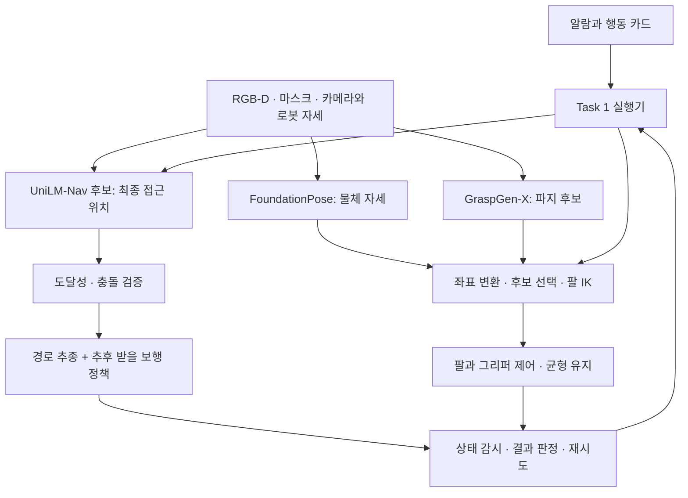

# Task 1: FoundationPose, UniLM-Nav, GraspGen-X 적용 검토

검토일: 2026-09-28. 사용자는 Task 1을 담당하며, 보행 체크포인트는 추후 제공받아 연결한다.
현재 우선순위는 인식, 조작을 위한 접근 위치 선정, 파지 계획 및 행동 실행기의 구성이다.
이 문서는 설치 전 논문·공개 코드·현재 USD를 대조한 검토 기록이다.
이후 FoundationPose와 GraspGen-X 설치·추론은 [TASK1_FIRST_EXPERIMENT.md](TASK1_FIRST_EXPERIMENT.md)에 기록했다.
UniLM-Nav 코드 실행 및 H1의 실제 보행·파지 동작 검증은 아직 수행하지 않았다.

사용자 확인: 최종 그리퍼 종류와 로봇 파일(USD/URDF)은 아직 정해지지 않았다.
현재 공개 H1은 검토용 기준 자산이며, 최종 하드웨어와 동일하다고 가정하지 않는다.

## 판단

| 모듈 | Task 1에서 맡길 역할 | 현재 적용 판단 |
|---|---|---|
| FoundationPose | 대상 물체의 6D 위치·자세 추정과 추적 | RGB-D와 대상 모델을 준비하면 독립 실험부터 시작 가능 |
| UniLM-Nav | 물체를 조작하기 좋은 로봇의 최종 접근 위치·방향 선정 | 구조적으로 적합. 확인한 공식 페이지에는 실행 코드 링크가 아직 없음 |
| GraspGen-X | 그리퍼 형상을 반영한 6D 파지 후보와 점수 생성 | 후보 생성 실험 가능. 최종 H1 그리퍼와 팔의 실행 가능성 검증 필요 |

Task 1 실행기는 알람에 맞는 행동을 고르고, 필요한 모듈을 호출하고,
도달 가능성·충돌·상태를 확인하며, 실패 시 중단·재시도·재접근을 결정한다.
세 논문이 이 실행기 전체를 제공하는 것으로 보아서는 안 된다.

## FoundationPose

공식 `run_demo.py`의 모델 기반 경로는 대상 메시를 읽고, 첫 프레임에서
`register(K, rgb, depth, ob_mask)`를 호출한다. 이후에는 `track_one(rgb, depth, K)`를 사용하며
물체 좌표를 카메라 좌표로 변환하는 4×4 행렬을 기록한다.
따라서 초기 대상 마스크 및 대상 선택은 별도 입력이다.

현재 시뮬레이터에서 RGB, 미터 단위 깊이, 카메라 내부행렬 K, 대상 마스크,
카메라 자세, 대상 메시를 추출하는 어댑터를 만들면 된다.
먼저 시뮬레이터 마스크로 자세 추정 자체를 평가한 뒤 실제 검출·분할 결과로 교체한다.
초기 마스크에 정답을 사용한 결과를 전체 인식 파이프라인의 성능으로 보고하지 않는다.
메시 원점·축·크기와 USD 변환의 일치를 검증해야 한다.
얇은 PCB, 대칭 형상, 겹쳐 놓인 PCB의 가림은 이 프로젝트에서 검증할 조건이다.

근거: [공식 데모 코드](https://github.com/NVlabs/FoundationPose/blob/a1b694b83e633c2cb6115b9063d940a687759392/run_demo.py),
[자세 추정 구현](https://github.com/NVlabs/FoundationPose/blob/a1b694b83e633c2cb6115b9063d940a687759392/estimater.py),
[논문](https://arxiv.org/abs/2312.08344).

## UniLM-Nav

논문은 목표 근처까지의 object navigation 이후, 조작 가능한 위치로 마지막 접근을
조정하는 문제를 다룬다. 입력에는 최근 RGB-D 관측과 카메라·로봇 자세, 작업 지시,
로봇 형상 및 장애물 정보가 필요하다. MLLM으로 관측을 선택하고 작업 지점을 찾은 뒤,
깊이로 3D 위치를 구해 베이스 위치를 추론한다. 방향은 작업 지점을 바라보도록 기하학적으로 계산한다.
결과 `(x, y, theta)`를 실행할 경로 계획·이동 제어는 별도다.
논문의 실기 플랫폼은 B2 + Z1이며, H1의 이족 균형과 팔 도달성은 별도 검증 대상이다.

2026-09-28 공식 페이지의 Code 앵커는 `href="#"`였다.
GitHub 저장소 이름 검색에서도 프로젝트 웹사이트 저장소만 확인했다.
사용자도 별도 코드 저장소 없이 이 프로젝트 페이지만 알고 있다고 확인했다.
같은 날 재확인한 Code 앵커도 `href="#"`였다. 현재 확보된 공식 실행 코드는 없으며,
이는 모든 경로에서 코드가 존재하지 않는다는 단정은 아니다.
따라서 초기 환경 구축의 필수 의존성에서 제외하고, 논문에 기반한 재구현 후보로 취급한다.
접근 위치 선정은 고정 위치 또는 기하학적 후보 생성으로 먼저 연결할 수 있도록 설계한다.
이 대체 구현의 결과는 UniLM-Nav 공식 코드 실행 결과로 보고하지 않는다.

근거: [논문 3–4절 및 부록 B.6](https://arxiv.org/html/2607.06537v2),
[공식 프로젝트 페이지](https://unilm-nav.github.io/).

## GraspGen-X

공개 코드에는 분할된 물체 포인트클라우드 또는 메시와 그리퍼 표현을 받아
파지 행렬과 점수를 만드는 경로가 있다. 공식 ZMQ 서버도 제공된다.
`infer_scene_depth`는 깊이[m], K, 인스턴스 마스크와 그리퍼 sweep-volume 정보를 받아
카메라 좌표계의 파지 후보를 반환한다.

새 그리퍼는 URDF·메시·개폐 설정으로 등록할 수 있다. 별도의 params-only API는
열림·반쯤 닫힘 상태에서 손가락이 차지하는 내부 공간을 두 박스, 12개 수치로 받는다.
이 API는 그리퍼 충돌 메시를 입력받지 않으므로 주변 장면에 대한 충돌 필터를 수행하지 않는다고 문서에 명시되어 있다.
실제 H1의 팔 IK, 팔·몸통·환경 충돌, 손가락 개폐, 접촉 유지와 균형 검증이 필요하다.
좌우 손 각각의 후보만 생성해도 양손 협조 파지가 완성되는 것은 아니다.

기본 planner는 diffusion과 OBB 후보를 합친 GraspMoE다.
확산 모델 단독 비교 시 `planner="diffusion"`을 명시하고 모델·설정·코드 버전을 기록한다.
사전학습 가중치와 gripper_descriptions는 코드의 외부 의존성이며 최초 import 시 다운로드 코드가 실행될 수 있다.

근거: [공식 저장소](https://github.com/NVlabs/GraspGenX),
[서버 입출력 계약](https://github.com/NVlabs/GraspGenX/blob/b9429097728cb1c430dd78b92edf17ba318aad03/client-server/README.md),
[논문 및 추가 업데이트](https://arxiv.org/html/2606.00998v1).

## 현재 H1·물체에서 확인한 제약

현재 공개 장면의 H1 한 팔에는 어깨 3축과 팔꿈치 1축, 총 4개의 회전 관절이 있다.
따라서 고정된 몸체에서 일반적인 6D 파지 자세를 모두 달성할 수 있다고 가정할 수 없다.
여러 후보 중 IK가 가능한 것을 고르거나, 베이스·몸통 자세와 접근 방향을 함께 조정해야 한다.
이는 현재 자산에 대한 판단이며, 추후 받을 로봇의 팔·손목 구성은 확인해야 한다.

H1 하위에 그리퍼/손가락으로 명명된 prim과 Camera prim은 발견되지 않았다.
`/World/Dadong/F2/PCBStacks` 아래 확인한 PCB 예제는 Cube이며,
해당 하위 트리에서 RigidBodyAPI는 발견되지 않았다. 확인한 개별 `pcb0`–`pcb4`에는
CollisionAPI도 없다. 실제 들어 올리기 실험에는 별도 동적 물체 설정이 필요하다.

근거: `research/task1_module_review_20260928/robot_object_constraints.json`,
`outputs/task1_readiness/scene_audit.json`.

## 권장 연결 구조

FoundationPose를 거쳐야만 GraspGen-X를 사용할 수 있는 것은 아니다.
관측 포인트클라우드로 직접 파지를 생성하면 그 입력 좌표계를 사용한다.
물체 모델 좌표계에서 파지를 미리 계산하는 경우에는 물체 자세 추정으로 월드에 옮긴다.
두 방식에서 물체 변환을 중복 적용하지 않도록 한다.

좌표 계약 제안: `T_A_B`는 B 좌표를 A 좌표로 변환한다.

- 카메라 포인트클라우드 경로: `T_W_G = T_W_C @ T_C_G`.
- 물체 메시 경로: `T_W_G = T_W_C @ T_C_O @ T_O_G`.
- G는 모델이 정의한 그리퍼 기준점이다. 로봇의 TCP·손목 링크와의 고정 변환을 별도로 적용한다.
- Isaac/USD 카메라축과 OpenCV 카메라축, quaternion 순서, 미터 단위, 시각을 명시한다.

## 환경 구성 제안

Isaac Sim, FoundationPose, GraspGen-X를 별도 Python 환경과 프로세스로 둔다.
확인한 FoundationPose 커밋의 `requirements.txt`는 `numpy>=2`,
GraspGen-X의 `pyproject.toml`은 `numpy==1.26.4`를 요구한다.
따라서 현재 명세 그대로는 두 모델을 한 환경에 함께 설치할 수 없다.
FoundationPose에는 PyTorch3D·NVDiffRast·C++ 확장 빌드도 필요하다.
서버에는 `/usr/local/cuda-12.4/bin/nvcc`가 있으나 빌드 및 추론 성공은 아직 검증하지 않았다.

모델 프로세스에는 RGB-D·K·마스크·포즈·시간을 전달하고,
결과는 프레임 ID, 좌표계, 단위와 함께 받는다.
GraspGen-X의 공식 서버 인터페이스를 활용할 수 있다.
이 단계에서 ROS 2나 별도 운영체제 변경을 전제하지 않는다.

근거: [FoundationPose requirements](https://github.com/NVlabs/FoundationPose/blob/a1b694b83e633c2cb6115b9063d940a687759392/requirements.txt),
[GraspGen-X pyproject](https://github.com/NVlabs/GraspGenX/blob/b9429097728cb1c430dd78b92edf17ba318aad03/pyproject.toml).

## 보행을 기다리지 않고 진행할 실험

1. 고정 관찰 위치에서 공장의 대상 물체 하나를 정하고 RGB-D, K, 인스턴스 마스크,
   카메라·물체 정답 자세와 일치하는 메시를 추출한다. 첫 산출물은 모든 모델에 공통으로 넣을 관측 묶음이다.
2. FoundationPose의 자세 추정을 실행해 정답과 비교한다. 정답 마스크와 추정 마스크의 조건을 구분한다.
3. GraspGen-X의 후보를 현재 장면에 겹쳐 표시하고 좌표·스케일을 확인한다.
   최종 그리퍼가 미정이면 지원 그리퍼로 추론 경로만 검증하고 H1 파지 성공으로 보고하지 않는다.
4. 최종 로봇의 IK·충돌 조건으로 실행 가능한 후보의 비율을 확인한다.
   실제 손·물체 물리 설정을 갖춘 뒤 접근→닫기→들기→유지까지 별도 검증한다.
5. 접근 위치 선정은 고정 접근 위치 또는 기하학적 후보를 기준선으로 구성한다.
   UniLM-Nav 공식 코드 확보 또는 논문 기반 재구현 후 같은 파지 조건에서 비교한다.
   기준선·논문 기반 재구현·공식 코드 실행 결과는 구분한다.
6. 알람·행동 카드·중단·재시도 실행기에 위 모듈을 붙이고, 보행 수령 후 이동 구간을 통합한다.

단계별 비교에서는 한 번에 한 모듈을 바꾼다.
물체 자세 오차, 유효한 파지 후보 비율, 도달 가능성, 접촉 후 유지, 작업 성공률,
응답 시간과 실패 원인을 구분해서 기록한다. 시뮬레이터 정답을 입력으로 쓴 조건은 명시한다.

## 그리퍼 미정 상태의 진행 기준

FoundationPose와 공통 RGB-D 관측 구성은 그리퍼 선정 전에 진행한다.
GraspGen-X의 초기 추론에는 공개 코드가 지원하는 기준 그리퍼를 사용할 수 있지만,
이 선택을 최종 H1 장착 결정이나 H1 파지 성능 검증으로 취급하지 않는다.

선정 조건은 대상 PCB의 크기·두께·질량과 허용 접촉 부위, 랙의 접근 여유,
필요한 개폐 폭, 손끝 형상, 장착부·TCP, 팔의 도달 범위와 하중으로 정리한다.
한 손 작업인지 양손 협조 작업인지도 먼저 구분한다.
이 정보 없이 특정 그리퍼 모델의 적합성을 확정하지 않는다.
모델의 파지 점수와 기하학적 도달성을 먼저 비교하고, 후보 그리퍼의 동적 모델을
갖춘 뒤 물리 접촉·들어 올리기·유지 성능을 검증한다.

## 추후 확정하거나 받을 자료

- 최종 H1의 USD/URDF, 팔·손목 관절 구성, 그리퍼 형상·개폐 한계·TCP 정의.
- 보행 체크포인트와 함께 관측·행동 정의, 전처리, 관절 순서, 제어 주기, 게인 및 기본 자세.
- 정책이 팔 관절도 제어하는지, 조작 시 팔·몸통 제어를 어떻게 분담하는지.

UniLM-Nav는 사용자에게 별도 코드 링크가 없는 것으로 확인했다.
공식 코드가 공개되거나 별도로 확보될 때 적용 계획을 재검토한다.

보행 정책이 속도 명령을 입력받는 형태라면,
목표 위치 `(x,y,theta)`를 속도 명령으로 바꾸는 경로 추종기가 사이에 필요하다.
제공될 체크포인트의 입력을 확인하기 전에는 그 형식을 확정하지 않는다.

## 검토 범위와 기록

FoundationPose: `a1b694b83e633c2cb6115b9063d940a687759392`.
GraspGen-X: `b9429097728cb1c430dd78b92edf17ba318aad03`.
원문 코드의 필요한 파일만 `research/task1_module_review_20260928/`에 내려받아 읽었다.
이 폴더는 설치 가능한 전체 checkout이 아니며, 모델 가중치를 다운로드하거나 코드를 실행하지 않았다.
기존 공장 원본과 실행 중인 웹 GUI는 변경하지 않았다.
